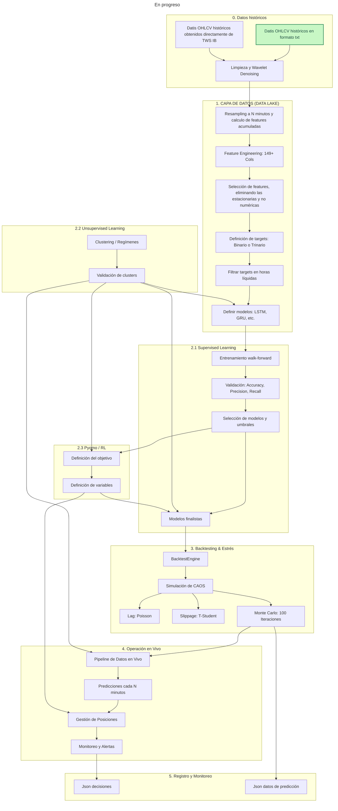
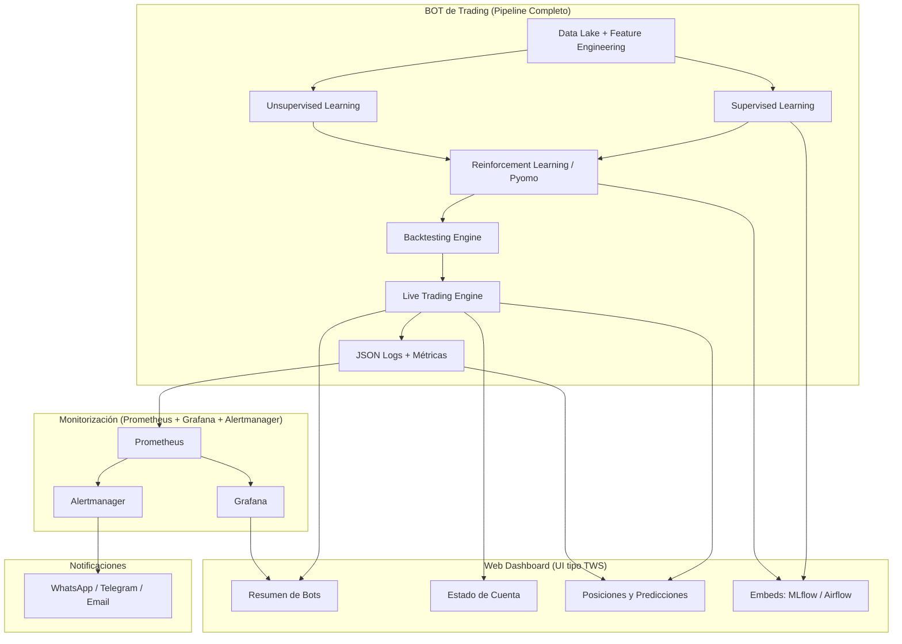

# Desarrollo de bot de trading algorítmico de futuros a partir de swing charts y apayado en modelos de ML.

**21/01/2026** 

## Diseño ideal del bot

## Diseño ideal de la arquitectura completa (todo dockerizado)

## Directorios
- DespliegueDocker
  - .yaml
  - PostgreSQL_bbdd
- TradingBots
  - Data
    - *.txt
  - Procesado
    - utils_procesado.py
    - visualizacion.ipynb
  - Train
    - utils_train.py
    - entrenamiento.ipynb
    - entrenamiento.py
  - Logs
  - Optimizacion
    - utils_optimizacion.py
    - optimizacion.ipynb
    - optimizacion.py
- Web
  - package.json
  - src

## Organización de todo el proyecto

- **TradingBots**
  - **Datos**
    - Datos de los precios OHLCV de los diferentes activos, en principio 4 (libra inglesa, crudo, e-mini sp500 y oro) tengo 8 archivos txt históricos con los datos día a día y minuto a minuto.
    - Datos del brocker o ficticios para testing, comisiones, spread, etc.
    - Logs e historial de funcionamiento de los bots.
    - Datos sobre los contratos, unidades por contrato, horas en las que se puede negociar, fluctuación mínima y fechas de expiración.
    - Los datos OHLCV quizás en txt, csv o parquet u otro formato.
    - Las métricas en postgreSQL.
  - **Procesado, preprocesado y postprocesado**
    - EDA y obtenición de los parámetros a usar para entrenar los modelos.
    - El EDA lo voy a reutilizar para la visualización de los bots.
    - Para obtener los parámetros voy a usar swingcharts usando candle sticks a partir de datos OHLCV día a día y minuto a minuto.
    - Tengo pensado probar distintos métodos para obtener los datos para los swingcharts
      - Zigzag
      - etc
    - También hay que sacar métricas de los modelos cuando entrenan y de los resultados que dan, tanto métricas de ML como métricas de trading.
  - **Predicción**
    - Mi idea es diseñar un bot para cada activo y quizás un bot para todos los activos y que las decisiones se tomen de manera conjunta o jerárquicamente.
    - Voy a probar con distintas estratégias con los bots.
      1. Que el bot decida si el precio va a subir, mantenerse o bajar, con esta información, usando reglas predefinidas se va a decidir si comprar o vender en short o long.
      2. Que el bot decida si ir long o short.
      3. Que un primer bot prediga cuanto va a variar el precio y un segundo bot decida qué acción tomar.
    - En principio la idea es dejar que los contratos expiren pero es posible que use o reglas o un bot para decidir si vender antes de tiempo.
    - Por otra parte, tengo que probar los modelos y optimizar los hiperparámetros de los modelos.
    - Además de probar con modelos de aprendizaje supervisado también quiero pobar con modelos de aprendizaje no supervisado para detectar tendendicas en los precios y quizás probar modelos de aprendizaje por refuerzo y por último de aprendizaje profundo.
    - Tengo que crear funciones para llamar a stop loss en caso de que los precios bajen demasiado y tenga contratos, también puedo considerar la posibilidad de añadir take profit.
  - **Optimización**
    - Una vez obtenido bots que tengan buenas ganancias, mi idea es optimizar a asignación de dinero a los bots.
    - He pensado en dos opciones.
      1. Usar Pyomo para optimizar ganancias teniendo en cuenta diferentes parámetros como ganancias o pérdidas o la volatilidad del mercado en un momento concreto, la optimización se puede hacer día a día o hora o hora o como se desee.
      2. Entrenar de alguna manera un modelo de ML para que tome esta decisión, seguramente un modelo de aprendizaje por refuerzo.
- **Web**
  - Página web donde visualizar toda la información relativa a los bots.
  - Voy a usar React junto a yarn o npm, por decidir.
  - El diseño lo voy a hacer primero en Canva.
  - Voy a hacer 4 páginas.
    - Página de inicio: Información del estado de los bots, si están tradeadon o no y en qué modo. Además, resumen de los trades del día/semana/mes/total. También, información de cuantos contratos de futuros tengo y el valor y el tipo.
    - Página de seguimiento de los bots: Usando plotly u otro visualizador, mostrar los swing charts de los distintos futuros y marcar con líneas verticales los momentos donde el bot ha realizado acciones incluyendo el precio, apalancamiento, fecha y la predicción.
    - Página de backtesting y modo offline: Poder elegir algún modelo y probar a ver como se comporta por ejemplo con otros datos. Todavía no lo tengo claro.
    - Página para añadir más datos: Controla a ver si los datos que se van recibiendo se vana añadiendo a las diferentes bases de datos y diferentes tablas. Tampoco lo tengo claro.
- **Docker**
  - En caso de que todo vaya bien procederé a desplegar todo el proyecto en Docker para que sea más fácil replicarlo.
  - Habrá dos partes.
    1. Lo primordial es conseguir que todo lo que he hecho hasta el momento funcione correctamente en Docker como si se estuviese corriendo de normal.
    2. Una vez conseguido esto y si hay tiempo, desplegar otros contenedores, por ejemplo grafana para ver que todo vaya bien o alertmanager para recibir información en Whatsapp solo el rendimiento de los bots, por ejemplo un reporte diario de como han ido o alertas por si alguno de los bots ha tenido que parar.
    3. También tengo pensado usar mlflow para reenrenar los modelos o entrenar otros nuevos y para guardar los datos y sacar métricas diarias.

---

# Diario
- **21/01/2026**
  Comienzo del proyecto de una vez por todas, después de atrasarlo desde el comienzo de las clases.
  Defino en líneas generales como tengo pensado dividir el trabajo y el código.

---

# Introducción TFG
> El presente proyecto tiene como objetivo el desarrollo e implementación de un sistema basado en técnicas de Machine Learning orientado al análisis y detección de patrones en “Swing Charts”, una herramienta ampliamente utilizada en el análisis técnico de los mercados financieros. A partir de datos históricos y en tiempo real, el sistema generará representaciones de “Swing Charts” a partir de “Bar Charts” y aplicará algoritmos de aprendizaje supervisado y no supervisado para identificar configuraciones recurrentes, como dobles máximos, dobles mínimos o rupturas de tendencia.
> 
> El desarrollo se llevará a cabo principalmente en Python, utilizando librerías como pandas, scikit-learn y matplotlib, además de entornos de conexión con plataformas de trading como Interactive Brokers API (IBKR). El proyecto busca evaluar la capacidad predictiva de los modelos entrenados y su utilidad en la generación de señales de compra o venta dentro de una estrategia de trading algorítmico. Con ello, se pretende aportar un enfoque innovador que combine la solidez del análisis técnico clásico con la adaptabilidad de las técnicas modernas de inteligencia artificial. 

---

# Asignaturas de las que he sacado conocimientos para el proyecto

:heavy_check_mark: Mucho conocimiento
:heavy_minus_sign: Algo de conocimiento
:heavy_multiplication_x: Nada de conocimiento

- Primero
  - Primer cuatrimestre
    - Álgebra
    - Cálculo
    - Fundamentos de Procesado de Datos
    - :heavy_check_mark: Programación
    - Desarrollo de Habilidades Profesionales
    - Introducción a la Ingeniería de Datos
  - Segundo cuatrimestre
    - :heavy_check_mark: Bases de Datos Relacionales y Datos Estructurados
    - Modelos Matemáticos y Matemática Discreta
    - Optimización
    - Señales y Sistemas
    - Sistemas de Adquisición de Datos

- Segundo
  - Primer cuatrimestre
    - Bases de Datos No Relacionales y Distribuidas
    - Uso Profesional de la Lengua Inglesa
    - Probabilidad y Señales Aleatorias
    - :heavy_check_mark: Programación para Big Data
    - Redes y Servicios de Comunicaciones
  - Segundo cuatrimestre
    - Fundamentos de Gestión Empresarial
    - Inferencia Estadística y Series Temporales
    - Redes de Sensores
    - Teoría de la Información
    - Sistemas de Comunicaciones para Ingeniería de Datos
    - Tecnologías Web

- Tercero
  - Primer cuatrimestre
    - Análisis de Señal
    - :heavy_check_mark: Aprendizaje Automático
    - Arquitecturas de Procesado Masivo de Datos
    - :heavy_check_mark: Computación en la Nube
    - Desarrollo Profesional del Ingeniero de Datos
    - Emprendimiento y Modelos de Negocio
  - Segundo cuatrimestre
    - :heavy_check_mark: Análisis y Visualización de Datos
    - Aplicaciones Sectoriales
    - :heavy_check_mark: Ingeniería Big Data en la Nube
    - Procesado Avanzado de Señales y Datos
    - :heavy_check_mark: Técnicas de Soporte a la Decisión

- Cuarto
  - Primer cuatrimestre
    - :heavy_check_mark: Proyectos de Ingeniería de Datos y Sistemas
    - Ciberseguridad y Protección de Datos
    - Gestión de Proyectos
    - Marco Ético y Legal
    - :heavy_check_mark: Ingeniería Web
  - Segundo cuatrimestre
    - Herramientas para la Computación y Visualización
    - Tecnologías de la Información Geoespacial
    - Electrónica de Consumo

## Contenido exacto de he aplicado de cada asignatura

- Programación
  - Python
- Bases de Datos Relacionales y Datos Estructurados
  - SQL
- Programación para Big Data
  - Sklearn
- Aprendizaje Automático
- Computación en la Nube
  - Docker
- Análisis y Visualización de Datos
  - Plotly
- Ingeniería Big Data en la Nube
- Técnicas de Soporte a la Decisión
  - Pyomo
- Proyectos de Ingeniería de Datos y Sistemas
- Ingeniería Web
  - React