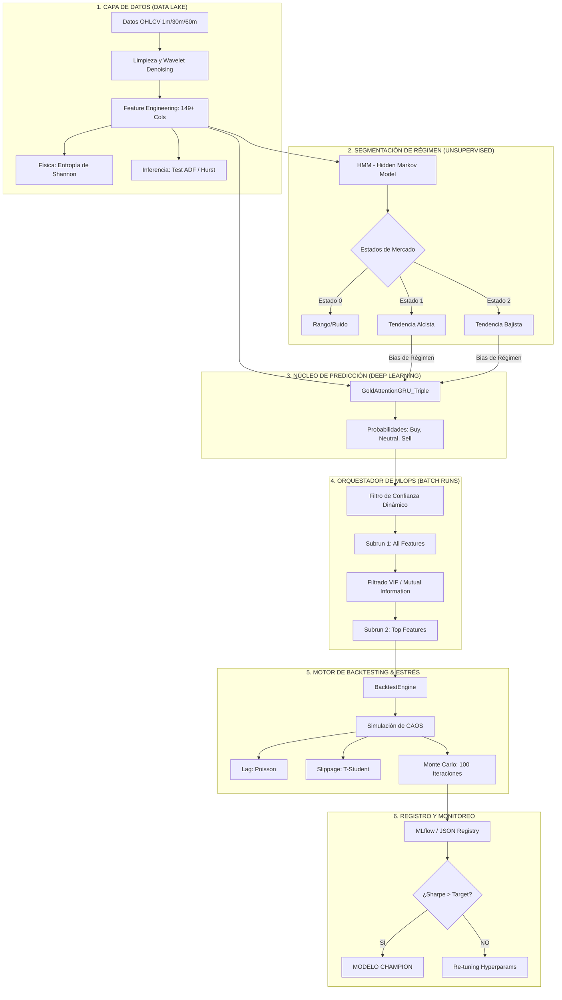

# Cosas que hacer hoy 26/03/2026
1. [x] Eliminar y ordenar archivos para que estén donde tienen que estar, en la branch alfa-0.1 estarán guardados y en el historial de versiones también.
2. Definir ETLs completos
3. Definir operacion

## ETL completo datos historicos
1. Cargar los datos minuto a minuto y las specs de cada futuro
2. Limpieza básica, filtrar horas y días no deseados
3. Generar todas las features (100 aprox)
4. Diseñar los modelos LSTM, probar tanto clasificación binaria como ternaria
5. Entrenar y validar con diferentes params
6. Backtest con umbrales de confianza y fees y spread reales, intentar simular retraso en la operación, por ejemplo con datos minuto a minuto que se use info de siguiente minuto
7. Calcular sharpe ratio, max drawdown y otros
8. Usar Shap para ver top 20/25 features y volver a pasos 4-7 para ver diferencias
9. Probar con datos históricos más actuales sacados de tws si es posible (último año)

## ETL completo datos en vivo
1. Obtener datos de la sesión del día o de los últimos dos días
2. Comprobar posiciones abiertas si las hay
3. Ejecutar las predicciones
4. Comprobar que tengo margen para entrar
5. Operar cada x minutos, calcular sl y tp
6. Añadir de momento lógica para que si hay dos predicciones seguidas de long o short para un futuro mantener la posición o ampliar, actualizar sl y tp si es necesario
7. Cerrar todas las posiciones antes del break

